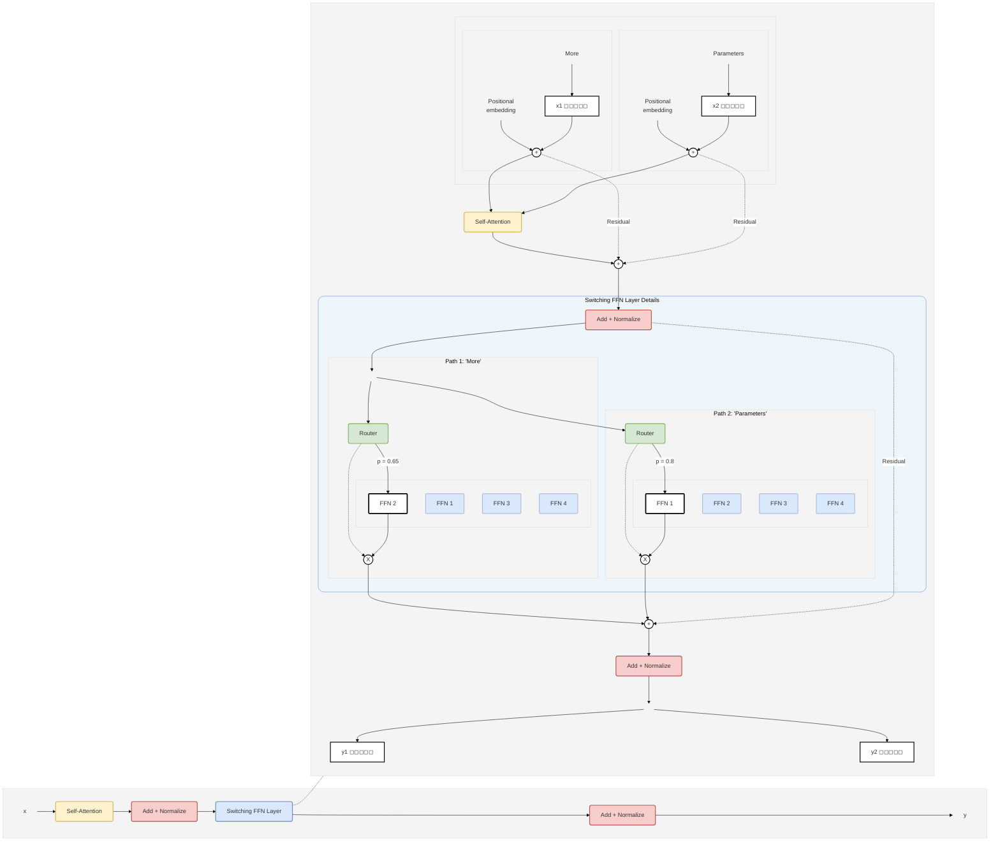

```mermaid
%%{init: {'theme': 'base', 'themeVariables': { 'primaryColor': '#ffffff', 'edgeLabelBackground':'#ffffff', 'tertiaryColor': '#f4f4f4'}}}%%
graph LR
    %% --- 样式定义 ---
    classDef yellowBox fill:#fff2cc,stroke:#d6b656,stroke-width:2px,rx:5,ry:5;
    classDef redBox fill:#f8cecc,stroke:#b85450,stroke-width:2px,rx:5,ry:5;
    classDef blueBox fill:#dae8fc,stroke:#6c8ebf,stroke-width:2px,rx:5,ry:5;
    classDef greenBox fill:#d5e8d4,stroke:#82b366,stroke-width:2px,rx:5,ry:5;
    classDef inputBox fill:#ffffff,stroke:#000000,stroke-width:2px;
    classDef plainText fill:none,stroke:none;
    classDef junction fill:#ffffff,stroke:#000000,stroke-width:2px,rx:15,ry:15;
    classDef selectedFFN fill:#ffffff,stroke:#000000,stroke-width:3px,rx:2,ry:2;
    classDef unselectedFFN fill:#dae8fc,stroke:#6c8ebf,stroke-width:1px,rx:2,ry:2;

    %% ====== 左侧：高层概览 ======
    subgraph LeftView [ ]
        direction TB
        X_L[x]:::plainText --> SA_L[Self-Attention]:::yellowBox
        SA_L --> AN1_L[Add + Normalize]:::redBox
        AN1_L --> SFFN_L[Switching FFN Layer]:::blueBox
        SFFN_L --> AN2_L[Add + Normalize]:::redBox
        AN2_L --> Y_L[y]:::plainText
    end

    %% 连接左右视图的虚线
    SFFN_L -.- RightContainer

    %% ====== 右侧：详细视图 ======
    subgraph RightContainer [ ]
        direction TB

        %% --- 输入阶段 ---
        subgraph Inputs [ ]
            direction LR
            subgraph Input1 [ ]
                direction TB
                I1_Text[More]:::plainText --> I1_Vec["x1 ◻◻◻◻◻"]:::inputBox
                PE1_Text[Positional\nembedding]:::plainText --> AddPE1((+)):::junction
                I1_Vec --> AddPE1
            end
            subgraph Input2 [ ]
                direction TB
                I2_Text[Parameters]:::plainText --> I2_Vec["x2 ◻◻◻◻◻"]:::inputBox
                PE2_Text[Positional\nembedding]:::plainText --> AddPE2((+)):::junction
                I2_Vec --> AddPE2
            end
        end

        %% --- Attention 块 ---
        AddPE1 --> SA_R[Self-Attention]:::yellowBox
        AddPE2 --> SA_R

        %% 残差连接 1 的汇合点
        SA_R --> ResJoin1((+)):::junction
        AddPE1 -.->|Residual| ResJoin1
        AddPE2 -.->|Residual| ResJoin1

        ResJoin1 --> AN1_R[Add + Normalize]:::redBox

        %% --- Switching FFN 核心层 ---
        subgraph SwitchFFN_Detail [Switching FFN Layer Details]
            style SwitchFFN_Detail fill:#eef6fc,stroke:#6c8ebf,rx:15,ry:15
            direction TB

            AN1_R --> RouterSplit{ }:::plainText

            %% 路径 1 (左侧示例)
            subgraph Path1 [Path 1: 'More']
                RouterSplit --> R1[Router]:::greenBox
                R1 --"p = 0.65"--> F2_1["FFN 2"]:::selectedFFN
                
                subgraph FFN_Bank1 [ ]
                    direction LR
                    F1_1["FFN 1"]:::unselectedFFN
                    F2_1
                    F3_1["FFN 3"]:::unselectedFFN
                    F4_1["FFN 4"]:::unselectedFFN
                end

                R1 -.-> Mult1((X)):::junction
                F2_1 --> Mult1
            end

            %% 路径 2 (右侧示例)
            subgraph Path2 [Path 2: 'Parameters']
                RouterSplit --> R2[Router]:::greenBox
                R2 --"p = 0.8"--> F1_2["FFN 1"]:::selectedFFN

                subgraph FFN_Bank2 [ ]
                    direction LR
                    F1_2
                    F2_2["FFN 2"]:::unselectedFFN
                    F3_2["FFN 3"]:::unselectedFFN
                    F4_2["FFN 4"]:::unselectedFFN
                end
                
                R2 -.-> Mult2((X)):::junction
                F1_2 --> Mult2
            end
        end

        %% --- 输出阶段 ---
        %% 残差连接 2 的汇合点
        Mult1 --> ResJoin2((+)):::junction
        Mult2 --> ResJoin2
        AN1_R -.->|Residual| ResJoin2

        ResJoin2 --> AN2_R[Add + Normalize]:::redBox

        %% 最终输出
        AN2_R --> OutputSplit{ }:::plainText
        OutputSplit --> Y1_Vec["y1 ◻◻◻◻◻"]:::inputBox
        OutputSplit --> Y2_Vec["y2 ◻◻◻◻◻"]:::inputBox
        
    end

```